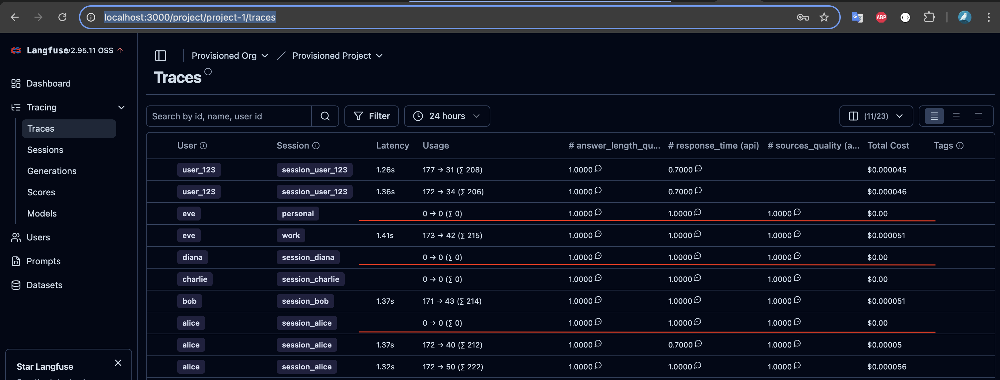

# RAG Finance Assistant - Complete Implementation Summary

**[Demo video](https://drive.google.com/file/d/1GMQpI4IfFaW4LdxmHwXNGxBdpU7HqkRk/view?usp=sharing)**

[**Module 4 Report**](REPORT_MODULE_4.md)

## Core Idea

Advanced RAG system for a financial SaaS service with support for:

- 🔍 Multi-sourcing (documentation + operational data via API)
- 💬 Chat Memory (remembers entire conversation)
- 📊 Observability (LangFuse for tracing and metrics)
- 🤖 LangGraph for intelligent routing

---

## 🎯 Implemented Features

### 1. Multi-sourcing (Two Data Sources)

#### A. Static Documentation (RAG Path)

- Vector search in Weaviate
- Chunking and embeddings (all-MiniLM-L6-v2)
- Top-K retrieval with metadata

#### B. Operational Data (Tool Calling Path)

- **6 Mock Finance API endpoints:**
  1. `get_transactions` - transactions for a period
  2. `get_cash_flow_report` - cash flow statement
  3. `get_account_balance` - account balances
  4. `get_profit_loss_report` - profit & loss statement
  5. `get_expense_categories` - expense categories reference
  6. `get_counterparties` - counterparties reference

### 2. Intelligent Routing

**Router Node** automatically determines the query type:
```
"How to create a report?" → Documentation (RAG)
"What is my balance?" → Operational (Tools)
```

LLM analyzes the question and selects the correct processing path.

### 3. Chat Memory (Conversation Memory)

#### Backend (Redis)
- History storage in Redis with 24-hour TTL
- Automatic session management
- API endpoints for history management

#### Frontend (localStorage)
- Automatic session_id saving
- Session restoration on reload
- "New Chat" button to start a new conversation
- Visual indicator "● Chat memory active"

#### Examples of contextual conversations:
```
User: Show my expenses for the month
Bot: For the month, your expenses totaled 450,000 tenge...

User: How much of that was for rent?
Bot: 150,000 tenge was spent on rent (remembers context!)
```

### 4. Observability (LangFuse)

- Self-hosted LangFuse in Docker
- Automatic tracing of all LangGraph nodes
- Metrics: latency, tokens, cost
- UI available at http://localhost:3000

**What is tracked:**
- Complete request execution path
- Execution time for each node
- LLM token usage
- Request costs

### 5. Security

- **User Context**: user_id passed to all API calls
- **Input Validation**: empty message validation
- **Demo Mode**: hardcoded user_id for testing
- **Session Isolation**: each user has their own history

---

## 🏗️ System Architecture

### LangGraph Pipeline

```
┌─────────────────────────────────────────────────────┐
│                    User Query                       │
└────────────────────┬────────────────────────────────┘
                     │
                     ▼
         ┌───────────────────────┐
         │    Router Node        │
         │  (LLM Classification) │
         └───────┬───────────────┘
                 │
        ┌────────┴────────┐
        │                 │
        ▼                 ▼
┌───────────────┐   ┌──────────────┐
│   RAG Node    │   │  Tools Node  │
│  (Weaviate)   │   │  (API Calls) │
└───────┬───────┘   └──────┬───────┘
        │                  │
        └────────┬─────────┘
                 │
                 ▼
      ┌──────────────────┐
      │  Generator Node  │
      │  (Final Answer)  │
      └──────────────────┘
                 │
                 ▼
      ┌──────────────────┐
      │  Save to Redis   │
      │  (Chat Memory)   │
      └──────────────────┘
                 │
                 ▼
      ┌──────────────────┐
      │  LangFuse Trace  │
      │  (Observability) │
      └──────────────────┘
```

### System Components

```
┌─────────────────────────────────────────────────┐
│              Docker Compose Stack               │
├─────────────────────────────────────────────────┤
│                                                 │
│  ┌──────────────┐  ┌──────────────┐           │
│  │   Weaviate   │  │    Redis     │           │
│  │ Vector Store │  │  Chat Memory │           │
│  └──────────────┘  └──────────────┘           │
│                                                 │
│  ┌──────────────┐  ┌──────────────┐           │
│  │  PostgreSQL  │  │   LangFuse   │           │
│  │ LangFuse DB  │  │   UI:3000    │           │
│  └──────────────┘  └──────────────┘           │
│                                                 │
│  ┌─────────────────────────────────────────┐  │
│  │         FastAPI Backend :8000           │  │
│  │  ┌───────────────────────────────────┐  │  │
│  │  │       LangGraph Pipeline          │  │  │
│  │  │  - Router                         │  │  │
│  │  │  - RAG                            │  │  │
│  │  │  - Tools                          │  │  │
│  │  │  - Generator                      │  │  │
│  │  └───────────────────────────────────┘  │  │
│  │                                          │  │
│  │  Services:                               │  │
│  │  - Memory Service (Redis)                │  │
│  │  - LangFuse Client                       │  │
│  │  - Mock Finance API                      │  │
│  └─────────────────────────────────────────┘  │
│                                                 │
└─────────────────────────────────────────────────┘
```

---

## 📁 Project Structure

```
rag-support-assistant/
├── backend/
│   ├── agents/                    # LangGraph components
│   │   ├── graph.py              # ⭐ Main graph
│   │   ├── state.py              # AgentState schema
│   │   └── nodes/
│   │       ├── router.py         # Query classification
│   │       ├── rag.py            # Vector search
│   │       ├── tools.py          # Tool calling
│   │       └── generator.py      # Answer generation
│   │
│   ├── tools/                     # API and tools
│   │   ├── mock_finance_api.py   # ⭐ Mock finance APIs
│   │   └── tool_definitions.py   # LangChain tools
│   │
│   ├── services/                  # Services
│   │   └── memory_service.py     # ⭐ Redis chat memory
│   │
│   ├── config/
│   │   └── settings.py           # ⭐ Pydantic settings
│   │
│   ├── observability/
│   │   └── langfuse_client.py    # LangFuse integration
│   │
│   ├── middleware/
│   │   └── auth.py               # User context (future)
│   │
│   ├── main.py                   # ⭐ FastAPI endpoints
│   ├── rag_service.py            # RAG logic
│   ├── llm_client.py             # LLM initialization
│   ├── db_client.py              # Weaviate connection
│   ├── loader.py                 # Data indexing
│   └── requirements.txt          # ⭐ Dependencies
│
├── frontend/
│   └── index.html                # ⭐ UI with chat memory
│
├── data/                         # Documentation for RAG
│   └── *.md
│
├── docker-compose.yml            # ⭐ Infrastructure
├── .env.example                  # ⭐ Configuration
│
└── Documentation:
    ├── README_IMPLEMENTATION.md  # Main documentation
    ├── CHAT_MEMORY_GUIDE.md      # Memory guide
    ├── FRONTEND_MEMORY_TEST.md   # Frontend testing
    └── SUMMARY.md                # This file
```

---

## 🔧 Technology Stack

### Backend
- **Python 3.11+**
- **FastAPI** - Web framework
- **LangGraph** - State machine for agents
- **LangChain** - LLM orchestration
- **LangFuse** - Observability
- **Redis** - Caching and chat memory
- **Weaviate** - Vector database
- **Sentence Transformers** - Local embeddings
- **Pydantic** - Validation and settings

### Frontend
- **Vanilla JavaScript** - No frameworks
- **Marked.js** - Markdown rendering
- **localStorage API** - Session_id persistence

### Infrastructure
- **Docker Compose** - Service orchestration
- **PostgreSQL 15** - LangFuse database
- **Azure OpenAI** - LLM provider

---

## 🚀 Quick Start

### 1. Environment Setup

```bash
# Copy configuration
cp .env.example .env

# Edit .env
nano .env
# Add: AZURE_OPENAI_API_KEY=your_key_here
```

### 2. System Launch

```bash
# Start all services
docker-compose up --build

# Services will start on ports:
# - Backend API: http://localhost:8000
# - LangFuse UI: http://localhost:3000
# - Weaviate: http://localhost:8080
# - Redis: localhost:6379
```

### 3. LangFuse Setup (optional)

```bash
# 1. Open http://localhost:3000
# 2. Create account and project
# 3. Copy Public Key and Secret Key
# 4. Add to .env:
LANGFUSE_PUBLIC_KEY=pk-lf-...
LANGFUSE_SECRET_KEY=sk-lf-...

# 5. Restart backend
docker-compose restart backend
```

### 4. Testing

**Manual testing**:

```bash
# Open UI
http://localhost:8000

# Memory test
1. "Hello! My name is Dias"
2. "What is my name?" → "Your name is Dias" ✅

# Routing test
1. "What is my balance?" → Tools Path
2. "How to reset password?" → RAG Path
```

**Using script**:

```bash
# Run test
python test_cache_quick.py
# View logs
```

---

## 📈 Metrics and Monitoring

Open LangFuse UI at http://localhost:3000

Login:

- Login: admin@example.com
- Password: supersecret

### LangFuse Dashboard

1. **Traces** - complete request path
2. **Latency** - execution time
3. **Tokens** - token usage
4. **Cost** - request costs
5. **Success Rate** - percentage of successful requests



Metrics show how caching helps:

- Reduce latency. Speed +, UX +
- Reduce cost. Economics +

---

## 📊 API Endpoints

### Chat Endpoints

#### POST /chat

Main endpoint for dialogue

**Request:**

```json
{
  "message": "What is my balance?",
  "session_id": "session_user_123"  // optional
}
```

**Response:**

```json
{
  "answer": "Your total balance is 2,100,000 tenge...",
  "sources": [
    {"title": "API: get_account_balance", "filename": "Operational Data"}
  ],
  "query_type": "operational",
  "processing_time_ms": 1523.45,
  "session_id": "session_user_123"
}
```

#### GET /chat/history/{session_id}

Get chat history

```bash
curl http://localhost:8000/chat/history/session_user_123?limit=20
```

#### DELETE /chat/history/{session_id}

Clear history

```bash
curl -X DELETE http://localhost:8000/chat/history/session_user_123
```

### System Endpoints

#### GET /health

Health check

#### GET /stats

System statistics

---

## 💡 Key Features

### 1. Automatic Routing

LLM determines where to route the request:

- **Documentation questions** → RAG (Weaviate)
- **Operational questions** → Tools (API calls)

### 2. Contextual Memory

System remembers the entire conversation:

```
User: Show expenses for the month
Bot: [expense data]

User: How much of that was for marketing?
Bot: [analyzes monthly expenses - remembers context!]
```

### 3. Persistence

- History saved in Redis (24 hours)
- Session_id in browser localStorage
- Session restored on reload

### 4. Observability

Complete tracing in LangFuse:

- Which path chosen (RAG/Tools)
- Time spent on each node
- Tokens used
- Request cost

### 5. Security

- User context in every API call
- Session isolation
- TTL for automatic data cleanup

---

## 🎨 Frontend Features

### UI Components

- **Chat Interface** - modern design
- **Markdown Support** - formatted responses
- **Typing Indicator** - processing indication
- **Sources Display** - data source display
- **Session Indicator** - "● Chat memory active"
- **New Chat Button** - quick start for new conversation

### UX Improvements

- Auto-save session
- Restore on reload
- Hints with example questions
- Smooth scrolling to new messages

---

## 📚 Documentation

### Main Documents
1. **README_IMPLEMENTATION.md** - Complete architecture guide
2. **CHAT_MEMORY_GUIDE.md** - Working with conversation memory
3. **FRONTEND_MEMORY_TEST.md** - Frontend testing
4. **SUMMARY.md** - This document

### API Documentation
- OpenAPI specification: http://localhost:8000/docs
- Redoc: http://localhost:8000/redoc

---

